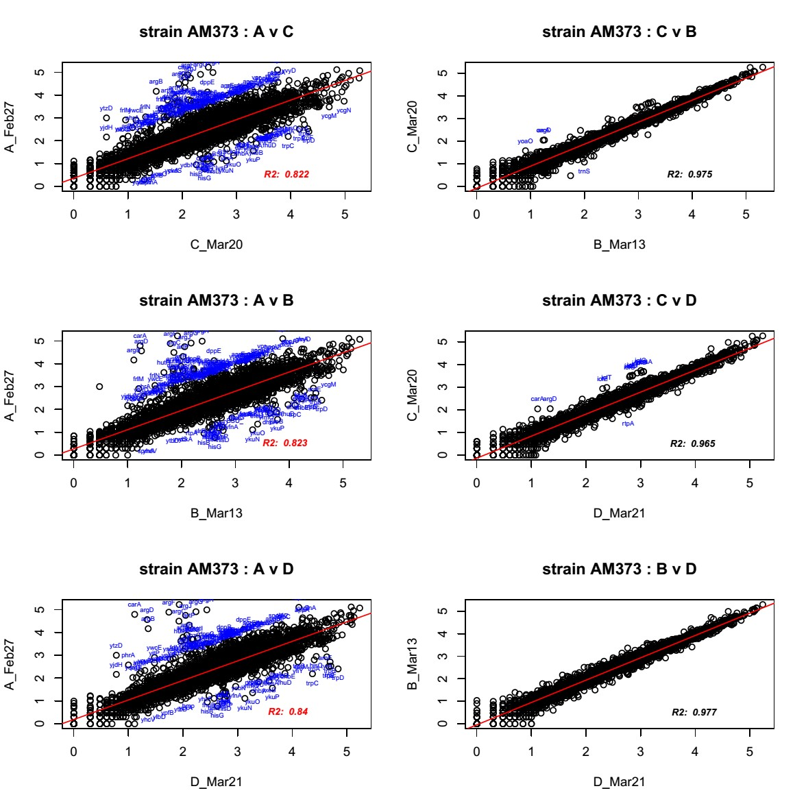
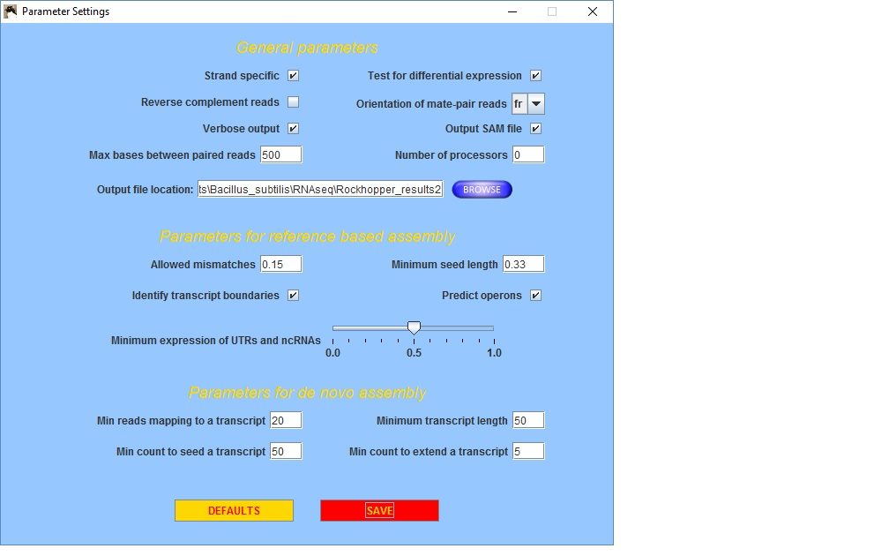

###Experiment summary:

Examining RNAseq data from 7 Bacillus subtiils strains derived from strain AM373. These strains represent three single-gene deletion strains, and the three double-KO combinations of those genes.

The strains were grown on Difco sporulation medium (DSM) to late-exponential phase in parallel in 96-well plates. Four experimental replicates of this set of strains were prepared, using the ScriptSeq v2 to generate RNAseq libraries.  Libraries were sequenced by HiSeq2500 generating 50bp single-reads.

One of the libraries (A) was discarded after examining scatterplots betweeen like-samples, in which all comparisons with samples in set A had R^2^ <0.9, while comparisons between like-samples in all other sets had R^2^ >0.95 (analysis location: '~/Bacillus_subtilis/RNAseq/dsm-rnaseq/collect-uniquereads_make-scatterplots.R')  

  

####Mapping data to genome  

The data was mapped to the B. subtilis 168 genome using both CLC workbench and Rockhopper.  Rockhopper-mapped data chosen after discoving it was able to successfully map slightly more reads, likely because it takes into account operon structure (it does not discard reads that map to the intersection of genes in the same operon). 



####Importing Data files
```{r}
gtab3<-read.csv("~/Bacillus_subtilis/RNAseq/Rockhopper_results2/NC_000964_transcripts_rawcounts_forDSEQ2.csv", row.names=1)

samp3<- read.csv("~/Bacillus_subtilis/RNAseq/Rockhopper_results2/Index_sheet-samplesums-Rockhopper2-b.csv", row.names=1)
samp3$strain<-factor(samp3$strain,levels=c("AM373","LiaS","McpA","NhaK","LM","LN","MN"))

#note:  Index_sheet-samplesums-Rockhopper2-b is a repaired version of Index_sheet-samplesums-Rockhopper2 which indicated that the 21-Mar RNAseq set had been dropped, rather than 28-Feb; however, the file names indicate Sample_RGMA001-7 (28-Feb) were the ones genuinely not included
```

**gtab3**:  table of mapped RNAseq counts.  Rows = genes, Columns = samples

**samp3**:  table of factors associated with each sample.  Includes strain designation (name of deleted gene or abreviation of pair of deleted genes), date (sample set by date collected), phenotype measurements associated with each strain, and library quality data

####Remove rRNA genes
Need to remove rRNA reads because all samples underwent rRNA depletion by ribozero (gram positive kit), making remaining levels not representative of native expression.  Accomplished by removing all genes with names starting with "rrn"
```{r}

rrn_rows<-which(substring(row.names(gtab3),1,3)=="rrn")
gtab3<-gtab3[-rrn_rows,]
```

Generate all pair-wise scatterplots using corrgram
```{r message=FALSE}
library(corrgram)
corrgram(gtab3,lower.panel=panel.pts,upper.panel =  panel.shade)

```

> most scatterplots are highly correlated, even across samples

Find all pairs with R^2^ < 0.95

```{r}

corg<-cor(gtab3)
cormat<-which(corg<0.95,arr.ind=TRUE)
cor_num<-signif(corg[which(corg<0.95)],digits = 3)
pair1<-row.names(corg)[cormat[,1]]
pair2<-colnames(corg)[cormat[,2]]
pairs<-cbind(pair1,pair2,cor_num)
print(pairs)
```

* within the same strain set, only AM373 pairs B & D have <0.95 correlation:  0.939 (marginally lower)  
* lowest correlation is `r min(corg)`, which is between `r pairs[which(as.numeric(pairs[,3]) == signif(min(corg),digits=3))[1],1:2]`

### DESEQ2 Analysis

The following work follows the [DESEQ2 demo](http://www.bioconductor.org/help/workflows/rnaseqGene/)

Note: Do not use ComBat with DESEQ2 because you do not end up with count data.  
Similarly, only use rlog data for exploratory analysis of data; DESEQ2 function uses raw counts

```{r warning=FALSE,message=FALSE}
library(DESeq2)

```


#### Filtering out low-count genes
Remove rows containing genes where no samples have any reads:  
```{r}

##DESEQ with desired design
dds<-DESeqDataSetFromMatrix(countData = gtab3,colData = samp3,design= ~date+strain)


#Remove rows containing genes where no samples have any reads
prefilt_num<-nrow(dds)
dds <- dds[ rowSums(counts(dds)) > 1, ]
```


Before filtering, there are `r prefilt_num` genes,  
After, there are `r nrow(dds)` genes,and  
     **`r prefilt_num - nrow(dds)` genes removed**
     
####Sample-to-sample relatedness     
Look at sample-to-sample relatedness, and signal improvement caused by the **DESEQ rlog transformation**:
```{r}
#rlog transformation
rld<-rlog(dds,blind=FALSE)

#plot first sample vs second, using raw vs rlog data
dds<-estimateSizeFactors(dds)

par( mfrow = c( 1, 2 ) )
plot(log2( 1 + counts(dds, normalized=TRUE)[ , 1:2] ),
     pch=16, cex=0.3)
plot(assay(rld)[ , 1:2],
     pch=16, cex=0.3)

```

**Conclusion**: can see that rlog transformed data (object 'rrd') reduces scatter between biological replicates, by reducing effect of noise when counts are low

####Distance heatmap
Generate heatmap conveying all distances between different samples, using rlog-transformed data
```{r message=FALSE}
    library("pheatmap")
    library("RColorBrewer")

    sampleDists<-dist(t(assay(rld)))
    
    sampleDistMatrix <- as.matrix( sampleDists )
    rownames(sampleDistMatrix) <- paste( rld$date, rld$strain, sep="-" )
    colnames(sampleDistMatrix) <- NULL
    colors <- colorRampPalette( rev(brewer.pal(9, "Blues")) )(255)
    pheatmap(sampleDistMatrix,
             clustering_distance_rows=sampleDists,
             clustering_distance_cols=sampleDists,
             col=colors,main="Heatmap of distances between all sample pairs")

```

Heatmap interpretation:  
  * 6/7 of the 20-Mar samples cluster together  
  * 3 of the 21-Mar samples cluster together  
  * The 3 LiaS samples all cluster together  
    
    
####Poison Distance heatmap
```{r message=FALSE}
    
   library("PoiClaClu")
    
    poisd <- PoissonDistance(t(counts(dds)))
    
    samplePoisDistMatrix <- as.matrix( poisd$dd )
    rownames(samplePoisDistMatrix) <- paste( rld$strain, rld$date, sep="-" )
    colnames(samplePoisDistMatrix) <- NULL
    pheatmap(samplePoisDistMatrix,
             clustering_distance_rows=poisd$dd,
             clustering_distance_cols=poisd$dd,
             col=colors,main="Poison clustering heatmap")

```

Conclusions:  
* largely similar to standard distance heatmap  
  * 5/7 of the 20-Mar samples cluster together  
  * 3 of the 21-Mar samples cluster together  
  * The 3 LiaS samples all cluster together  
    
  
####Princple Component Analysis

PCA, figure coded by batch:
```{r message=FALSE,warning=FALSE}
    
  plotPCA(rld, intgroup = "date")
    
```

**observations**:  
  * 20-Mar samples generally cluster higher and center on PC2 variable

#####PCA, figure coded by strain:
```{r message=FALSE,warning=FALSE}
    
  plotPCA(rld, intgroup = "strain")
    
```

**observations**:  
  * LiaS strains cluster on left (neg)-end of PC1; other strains seem well-scattered


#####PCA, figure coded by both batch and strain:
```{r message=FALSE,warning=FALSE}
    
    library(ggplot2)
    
    data <- plotPCA(rld, intgroup = c("date", "strain"), returnData=TRUE)
    percVar<-round(100* attr(data,"percentVar"))
    
    windows(60,60)
    #qplot(PC1, PC2, color=strain, shape=date, data=data, size=0.7,main="PCA of DSM March samples")
    ggplot(data,aes(PC1,PC2,col=strain,shape=date)) + geom_point(size=3) +
    xlab(paste0("PC1: ",percVar[1],"% variance")) +
    ylab(paste0("PC2: ",percVar[2],"% variance")) +
    ggtitle("Rock2 data PCA analysis, 12/2/15")

```

** overall, PC1 and PC2 account for ~60% of the observed variance **

####Multidimensional Scaling (MDS) plot - can use rlog or Poisson
    
   
```{r eval=FALSE}
    
windows(40,40)
    mdsData <- data.frame(cmdscale(sampleDistMatrix))
    mds <- cbind(mdsData, as.data.frame(colData(rld)))
    ggplot(mds, aes(X1,X2,color=strain,shape=date)) + geom_point(size=3)

```

* Not plotted because it is very similar to PCA plot
* LiaS samples still clustered, but less distinct
* Mar13 samples are all still in top-center


####Gene clustering
* identify and cluster only using the genes with the most variance between samples

```{r message=FALSE,warning=FALSE}

    library("genefilter")
    
    windows(70,70)
    topVarGenes <- head(order(-rowVars(assay(rld))),30)
    mat <- assay(rld)[ topVarGenes, ]
    rmgenes<-which(row.names(mat)=="liaS"|row.names(mat)=="nhaK"|row.names(mat)=="mcpA")
    # remove intentionally-deleted genes since these represent a lot of variation
    mat1<-mat[-rmgenes,]
    df <- as.data.frame(colData(rld)[,c("date","strain")])
    pheatmap(mat1, annotation_col=df,main = "30 top Var genes")  
    
```


  * see ~7 predicted RNAs
  * see LiaS and LN clustering together, due to immA/rapI/yddK gene exprs. shift
    * these genes are all in ICEbs1 conjugative transposon 
    
###Find significantly differentially-expressed genes

import raw data into DESEQ object, using a design with batch (date) and strain factors included:

```{r}
    
    #import raw data into DESEQ object
    dds<-DESeqDataSetFromMatrix(countData = gtab3,colData = samp3,design= ~date+strain)
    
```

In addition to removing genes with no counts, now also remove genes with fewer than 50 counts across all rows (very low reads):

```{r}
#prefliter dataset   -  rrn genes already removed
    pre_filt<-nrow(dds)   
    dds <- dds[ rowSums(counts(dds)) > 50, ]  #remove genes with less than 50 reads
    
```

Removed `r pre_filt-nrow(dds)` genes due to insufficient count, out of `r pre_filt` genes 

Perform DESeq analysis and generate summary:

```{r message=FALSE}
    
    dds<-DESeq(dds)    #this function includes "estimateSizeFactors"
    
    res<-results(dds)
    summary(res)
```

List of genes with significantly different expression (p<0.05) 
   * between first and last-ranked factor (AM373 reference strain & delta-NhaK)
```{r}
    options(width = 120)
  
  res.05<-results(dds,alpha=0.05)
  
  #import annotation file, and function 'top_genes' for adding annotation information
  source('~/Bacillus_subtilis/RNAseq/RNAseq_to_Github/top_genes_function.R')
  gdf<-read.csv("~/Bacillus_subtilis/RNAseq/Bsub_annotation/Bsub_Functional_Annotation_2016-04-12.csv",row.names=1)
  res.05b<-top_genes(res.05,nrow(res.05[which(res.05$padj<0.05),]))
  
```


* Only get a handful of significant differentially-expresssed genes (`r nrow(res.05[which(res.05[,6]<0.05),])`), and the deleted gene, NhaK, is by far the most strongly effected

###Plots of DEGs:

```{r echo=FALSE,fig.height=12,fig.width=12}
  
  par(mfrow=c(4,3))
  
  for(i in 1:nrow(res.05b)){
  
  plotCounts(dds,gene=row.names(res.05b)[i],intgroup="strain", col=c("black","red","blue"),pch=19)
  }
  
```

Mostly see that many DEGs are different primarily from AM373 reference strain, or AM373 and delta-LiaS strain. 

Table of DEGs:
```{r echo=FALSE}
  #Print table of DEGs
  library(knitr)
  ktab<-function(x){
  
  log_padj<-log(x[,6],base=10)
  x$padj<-log_padj
  colnames(x)[6]<-"log10.padj"
  for(i in c(2:6)){
    x[,i]<-signif(x[,i],digits=2)
  }
  x[,1]<-trunc(x[,1])
  x<-x[,c(8,7,10:13,9,15,6,2,1)]
  
  kable(x,format="markdown")
  }
  
  ktab(res.05b)


```

Most DEGs are predicted_RNAs, some with relatively low baseMean (<200)

Additional analysis in following files examine contrasts composed of particular pairs of strains or groups of strains to add power to the analysis.
