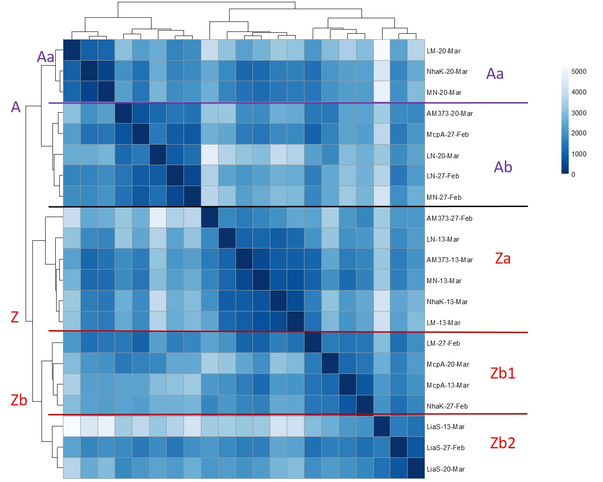
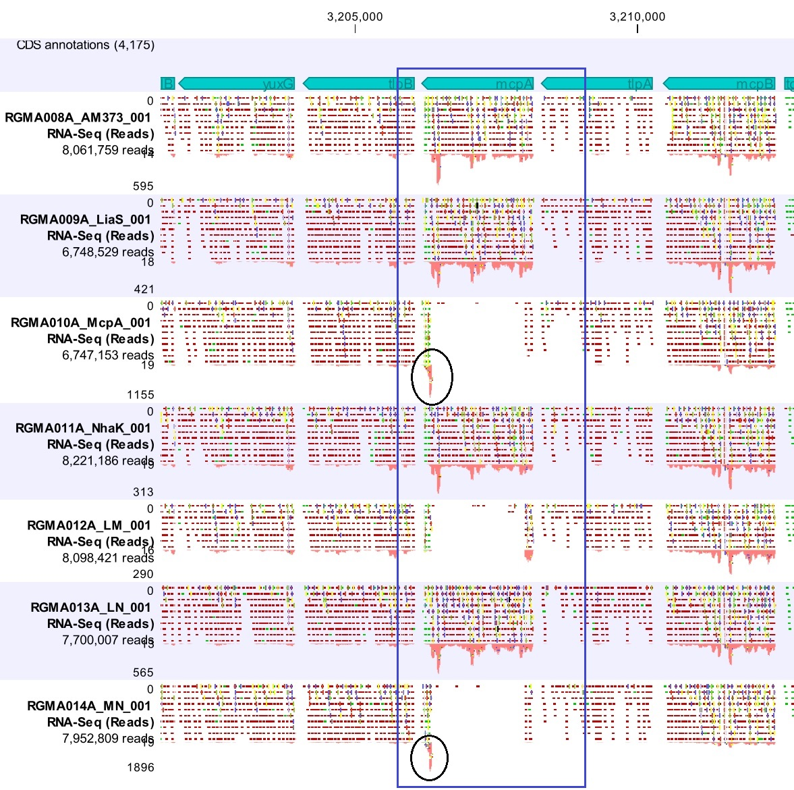
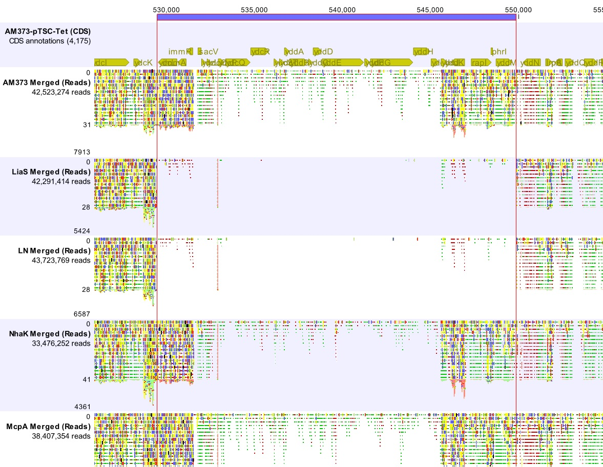

###Experiment Description:

This R Mardown document hosts analysis of RNAseq data collected from the LiaS-mutation set (LiaS, McpA, NhaK, LM, LN, MN) of AM373 during growth on DSM, specifically examining the RNAseq data for differential expression when different defined groups are contrasted.

The RNAseq data was mapped using Rockhopper, and initial QC analysis is in "Rock2-DeSeq-walkthrough_in_markdown.rmd"

###1. Import Data

```{r}

#Gene expression data:
gtab<-read.csv("~/Bacillus_subtilis/RNAseq/Rockhopper_results2/NC_000964_transcripts_rawcounts_forDSEQ2.csv", row.names=1)

#sample table:
samp3<- read.csv("~/Bacillus_subtilis/RNAseq/Rockhopper_results2/Index_sheet-samplesums-Rockhopper2-b.csv", row.names=1)

#Gene annotation file:
gdf<-read.csv("~/Bacillus_subtilis/RNAseq/Bsub_annotation/Bsub_Functional_Annotation_2016-04-12.csv",row.names=1)

gdf$ME_name<-as.character(gdf$ME_name)
gdf$ME_name <- sub("^$", "nonphage", gdf$ME_name)
gdf$ME_name<-as.factor(gdf$ME_name)

# Modify samp3: convert some columns to factors and establish strain order levels
samp3$GR_column<-as.factor(as.character(samp3$GR_Column))
samp3$strain<-as.factor(as.character(samp3$strain))
samp3$strain<-factor(samp3$strain,levels=c("AM373","LiaS","McpA","NhaK","LM","LN","MN"))
samp3$date<-as.factor(as.character(samp3$date))

#Modify gtab3: remove confounding and low-count genes
#remove rrn genes from gene expression data
rrn_rows<-which(substring(row.names(gtab),1,3)=="rrn")
gtab2<-gtab[-rrn_rows,]

#remove low-count genes, threshold of at least 50 counts between all samples
gtab3 <- gtab2[ rowSums(gtab2) > 50, ]

```

Number of rRNA genes: `r nrow(gtab)-nrow(gtab2)` genes dropped (from `r nrow(gtab)`)

Number of genes with <50 counts:  `r nrow(gtab2)-nrow(gtab3)` genes dropped

Note about file gdf: While looking up the genes indivdiually, I also noticed that many of the DEGs belong to mobile genetic element [ICEBs1](http://www.ncbi.nlm.nih.gov/pubmed/17511812); however, these genes are not included in any of the annotation, so I created two new columns, `Phage_ME` and `ME_name` to encode it; `ME_name` encodes either the name of the phage/mobile element or "nonphage"

```{r echo=FALSE,eval=FALSE}
to examine iceBS1 genes: 
icebs<-which(gdf$Start>529500 & gdf$Stop <550000)
gdf[icebs,]

```

Libraries used:

```{r message=FALSE, warning=FALSE}
library(DESeq2)
library(dplyr)
library(knitr)
library(ggplot2)
```

#### Useful Functions

Load function`top_genes` to make a results table, order and filter the genes by padj, and add basic annotation from file `gdf`

basic "Functional" annotation in `gdf` is from [subtiwiki](http://subtiwiki.uni-goettingen.de/wiki/index.php/Categories), flatfile downloaded 7/17/2015

```{r}
source('~/Bacillus_subtilis/RNAseq/RNAseq_to_Github/top_genes_function.R')
```


Functional Annotation Table generator function:
`factor_tab(tg_df, factor_name)`
creates table of in "FunctNameX" columns of DE gene table to show what functions are highly represented, and the total number of genes in that functional classification set for the whole genome (not quite a statistically-rigorous functional enrichment analysis yet)

```{r message=FALSE}

source('~/Bacillus_subtilis/RNAseq/RNAseq_to_Github/factor_tab_function.R')
```

ktab function: formats and reorginizes results dataframe into a cleaner "kable" table  
(coded within this document but not printed out)

```{r echo=FALSE}

ktab<-function(x){
  
  log_padj<-log(x[,6],base=10)
  x$padj<-log_padj
  colnames(x)[6]<-"log10.padj"
  for(i in c(2:6)){
    x[,i]<-signif(x[,i],digits=2)
  }
  x[,1]<-trunc(x[,1])
  x<-x[,c(8,7,10:13,15,6,2,1)]
  
  kable(x,format="markdown")
}

```

### 2. Run DESEQ2

```{r message=FALSE, warning=FALSE}

#generate DESeqData object
  # design takes into account date (RNAseq batch) and strain identity
ddsBsub<-DESeqDataSetFromMatrix(countData = gtab3,colData = samp3,design= ~date+strain)

#run DESeq on object
ds<-DESeq(ddsBsub)
res<-results(ds)  #to generate a 'results' table from the DESeqDataSet object 'ds'

#rlog trans
rld<-rlog(ddsBsub,blind=FALSE)

#estimate size factors
dds<-estimateSizeFactors(ddsBsub)

```

### 3. Batch Effects

**DESeq2 QC analysis showed some batch effects in data; can now explore what genes are responsible and their functional groups**

#### 3.1 Principle Component Analysis

Plot of PC1 vs PC2 shows:
* batch "Mar21" is largely on the upper range of PC1 compared to most other measures, while the 3 liaS-deletion strains compose the lower-most range of PC1
* batch "20-Mar" is clustered on upper range of PC2

```{r echo=FALSE,fig.height=5,fig.width=7}

#PCA plot by batch    
plotPCA(rld, intgroup = "date")+
  ggtitle("Principle Component 1 vs 2")+
  theme(plot.title = element_text(lineheight=2, face="bold",size=18))
```

**21-Mar vs other 2:**  
DESEQ analysis using batch at factor, by creating a factor that distinguishes "21-Mar" batch from the other two

Top 9 differentially-expressed genes (based lowest p-adjusted value):

```{r }

isMar21<-relevel(as.factor(ifelse(samp3$date=="21-Mar","21-Mar","other")),ref="other")

sampb1<-cbind(samp3,isMar21)
resb1<-results(DESeq(DESeqDataSetFromMatrix(countData = gtab3,colData = sampb1,design= ~strain+isMar21)))
B1<-top_genes(resb1,num=length(which(resb1$padj<0.05)))

ktab(B1[1:5,])

```

* can see that the most drastically changed transcripts were mostly predicted RNAs 

__Table of DEGs (differentially-expressed genes) based on their level-1 Functions: __ 

DEGs: Number of differentially expressed genes
all_in_cat: total number of genes in genome in this catagory
perc: the percentage of genes in this category that were dif. expressed
Up/Dwn: Number of DEGs in category that had increased or decreased expression relative to the reference level

```{r}
factor_tab(B1,"FuncName1")
```

* over half of the Differentially Expressed Genes (DEGs) are pred_RNAs, and almost all of them are downreguated  
* metabolism and cell process DEGs are also generally more upregulated  

Functional group, level 2:

```{r echo = FALSE,set-options}

options(width=500)
factor_tab(B1,"FuncName2")

```

* amino acid metabolism, additional metabolic pathways, carbon metabolism, electron transport DEGs are all generally up compared to other batches - whereas protein synthesis is down

* 21-Mar samples were collected within an OD range sampled by the other two batches, using the same batch of LB, so the cause of these metabolic differences is not clear

GoH analysis:
```{r}
ktab(B1[which(B1$GoH.Core=="GoH_core"),])

```

Only GoH Core DEG in set is [ydbI](http://subtiwiki.uni-goettingen.de/bank/index.php?gene=BSU04480&action=Go), which has an unknown function. It has slightly lower expression in 21-Mar sample than the others.


**20-Mar analysis:**
Same as above, but contrasting 20-Mar samples to the other two

Top 10 DEGs:
```{r echo=FALSE}

isMar20<-relevel(as.factor(ifelse(samp3$date=="20-Mar","20-Mar","other")),ref="other")

sampc1<-cbind(samp3,isMar20)
resc1<-results(DESeq(DESeqDataSetFromMatrix(countData = gtab3,colData = sampc1,design= ~strain+isMar20)))
C1<-top_genes(resc1,num=length(which(resc1$padj<0.05)))

ktab(C1[1:10,])

```

* "Groups of genes", two predicted RNAs located within other DEGs, and two tRNAs were most significantly different between the two datasets

Functional groups of DEGs:  
```{r}
factor_tab(C1,"FuncName1")
```

* 20% of metabolic genes have differential expression, most of them down!

Functional Level 2 categories:  

..within metabolism FuncName1 category:
```{r }
factor_tab(C1[which(C1$FuncName1=="Metabolism"),],"FuncName2")
```
 
 *see that within metabolism, almost all classes are generally less expressed in the Mar-20 batch - except nucleotide metabolism, which has increased transcription

 
..other FuncName2 catagories:
```{r }
factor_tab(C1[-which(C1$FuncName1=="Metabolism"),],"FuncName2")
```

* see that aside from reduced metabolism, this batch has increased expression of many transporters and membrane proteins
 
 * The slowed metabolism of the 20-Mar batch is also demostrated by the lower max GRs achieved by the cultures on that day
 ..*this also contributed to the cultures being harvested across a slightly wider OD range on that date


```{r }
par(mfrow=c(1,2))

stripchart(samp3$avg_OD~samp3$date,vertical=TRUE,ylab="OD(600)",main="OD at sample collection")
stripchart(samp3$avgVmax~samp3$date,vertical=TRUE,ylab="OD(600nm)/hr",main="max Growth Rate")

```

* __Unfortunately, this suggests that most of the expression variance in this dataset is due to slightly different growth rates on different days, and differences in the OD when the cultures were harvested.__

GoH analysis:
```{r}
ktab(C1[which(C1$GoH.Core=="GoH_core"),])

```

Again, the only GoH Core DEG in set is [ydbI](http://subtiwiki.uni-goettingen.de/bank/index.php?gene=BSU04480&action=Go).  
It has slightly higher expression in 20-Mar sample than the others.
 
 
  
#### 3.2 DEGs underlying Poisson Clustering:

The samp3 file includes a factor named "cluster" based on the groups defined by Poisson clustering this group (see `Rock2-DeSeq-walkthrough_in_markdown`), which are marked and labeled in the following image:



> Note: The clustering was done with an image with the batch names mis-labeled; 27-Feb = 13-Mar, 13-Mar = Mar20, Mar20 = Mar21;

Most 20-Mar samples (13-Mar in figure) and the LiaS single strains all fall in the Z-group, suggesting this group may be characterized by slower growth than the A-clusters.


```{r }
par(mfrow=c(1,2))

stripchart(samp3$avg_OD~samp3$cluster,vertical=TRUE,ylab="OD(600)",main="OD at sample collection, by cluster")
stripchart(samp3$avgVmax~samp3$cluster,vertical=TRUE,ylab="OD(600nm)/hr",main="max Growth Rate before harvest, by cluster")

```

There is slight correlation between the Poisson cluster and maxGR reached by each sample, in which the "A" clusters generally acheived faster growth rates.  However, there seems to be little relationship to OD at which the cells were harvested.

(although there is a lot of overlap in the growth rate ranges spanned by each group)

__DEG analysis of cluster A v Z: __  (cluster Z is reference) 

Top 5 DEGs:
```{r }

isAZ<-relevel(as.factor(ifelse(substring(samp3$cluster,1,1)=="A","clustA","clustZ")),ref="clustZ")

sampaz1<-cbind(samp3,isAZ)
resAZ1<-results(DESeq(DESeqDataSetFromMatrix(countData = gtab3,colData = sampaz1,design= ~strain+isAZ)))
AZ1<-top_genes(resAZ1,num=length(which(resAZ1$padj<0.05)))

ktab(AZ1[1:5,])

```

Many top DEGs in the "A" cluster seem to be involved in nitrogen/amino acid metabolism; utilization of urea and biosynthesis of amino acids


Functional categories of DEGs:

```{r}
print("FuncName1 Categories:")
factor_tab(AZ1,"FuncName1")
print("FuncName2 Categories within Metabolism:")
factor_tab(AZ1[which(AZ1$FuncName1=="Metabolism"),],"FuncName2")
print("FuncName2 Categories within Cellular processes:")
factor_tab(AZ1[which(AZ1$FuncName1=="Cellular processes"),],"FuncName2")
print("FuncName2 Categories within Information Processing:")
factor_tab(AZ1[which(AZ1$FuncName1=="Information processing"),],"FuncName2")
factor_tab(AZ1[which(AZ1$FuncName2=="exponential and early post-exponential lifestyles"),],"FuncName3")
```

* Functional analysis basically re-interates that the group "A" clusters have increased metabolism, related to increased amino acid/nitrogen and carbon metabolism, electron transport, and expression of stress response genes.  Also have increased expression of many motility and chemotaxis genes.


GoH analysis:
```{r}
ktab(AZ1[which(AZ1$GoH.Core=="GoH_core"),])

```

**Find 4 GoH Core DEGs**
[xhlA](http://subtiwiki.uni-goettingen.de/bank/index.php?gene=xhlA&action=Go) - "involved in cell lysis upon induction of PBSX" - lower in "A" cluster
[ydbI](http://subtiwiki.uni-goettingen.de/bank/index.php?gene=BSU04480&action=Go) - Unknown function - lower in "A" cluster
[smc](part of the condensin complex, chromosomal origin condensation and segregation SMC protein) - "part of the condensin complex, chromosomal origin condensation and segregation SMC protein" - lower in "A" cluster
[ppsC](http://subtiwiki.uni-goettingen.de/bank/index.php?gene=ppsC&action=Go) - "production of the antibacterial compound plipastatin" - higher expression in "A" cluster

* Currently unclear what to make of this result since it is difficult to relate these clusters meaningfully to genotype or phenotype

### 4. Examine effect of antibiotic markers

#### 4.1 Kanamycin 
Examine whether there is evidence that the kanamycin resistance marker correlates to gene expression changes.  In samp3, there is a column "kan", that indicates whether a strain harbors the kan resistance gene (yes/no) that is used to perform this analysis.
```{r message=FALSE}

options(width=150)
resKan<-results(DESeq(DESeqDataSetFromMatrix(countData = gtab3,colData = samp3,design= ~date+kan)))
resKansig<-resKan[order(resKan$padj),]
kable(resKansig[1:4,],format="markdown",digits = 4)
```

*  See that only NhaK expression is the only DEG between kan-resistant and kan-sensitive samples, which is expected since kan is only in NhaK-deletion strains  


#### 4.2 Zeocin

```{r message=FALSE,width=120}
resZeo<-results(DESeq(DESeqDataSetFromMatrix(countData = gtab3,colData = samp3,design= ~date+zeo)))
resZeosig<-resZeo[order(resZeo$padj),]
kable(resZeosig[1:4,],format="markdown",digits=4)

```

* See a bunch of predicted RNAs occupy top ranked most differentially expressed  

* only top one (pred_RNA_3206218bp) is stat sig (10^-31^); that locus is within mcpA gene  
* next one in list is the opposite strand of the yvyD gene(a sigma modulator), and then opposite strand of 5'end of qoxB (quinone)  


**Plots of RNA 3206218 and mcpA transcription levels, by strain and by presence of zeocin cassette:**

```{r echo=FALSE}

par(mfrow=c(2,2))
plotCounts(DESeqDataSetFromMatrix(countData = gtab3,colData = samp3,design= ~date+zeo),gene="pred_RNA_3206218bp",intgroup="strain", col=c("black","red","blue"),pch=19)
plotCounts(DESeqDataSetFromMatrix(countData = gtab3,colData = samp3,design= ~date+zeo),gene="mcpA",intgroup="strain", col=c("black","red","blue"),pch=19)
plotCounts(DESeqDataSetFromMatrix(countData = gtab3,colData = samp3,design= ~date+zeo),gene="pred_RNA_3206218bp",intgroup="zeo", col=c("black","red","blue"),pch=19, main="3206218bp, zeo-marker presence")
plotCounts(DESeqDataSetFromMatrix(countData = gtab3,colData = samp3,design= ~date+zeo),gene="mcpA",intgroup="zeo", col=c("black","red","blue"),pch=19, main="mcpA gene, zeo-marker presence")

```

Summary conclusions, zeocin effects:  
* `pred_RNA_3206218bp` is only elevated in strains with zeocin cassette, ie, the McpA and MN strain  

* _why isn't mcpA expression very low in all of the mcpA-deletion strains?_
  
..* both effects may be from transcription of zeocin gene and its immediate upstream region, which was put on the opposite strand of mcpA;  however, in LM the antiboitic cassette was completely removed by Cre recombinase, so the antibiotic is not driving transcription in that region  

*Explatation:*
This CLC workbench image of its mapping of these reads shows that the bulk of the mcpA gene had very few reads (ie, was successfully deleted), but a glut of reads of the non-deleted 3'end of the gene (mcpA is encoded on bottom strand) that likely account for a relatively high total count of reads found for the gene in these strains.  


The top bar in the above image displays the genes in displayed section of the mapped genome, with the position of the mcpA gene indicated by the blue box.  The mapped reads of each library (one per strain) are disiplayed bellow.  The name of the library indicates the strain between the two undercores.  Circles highlight the 3' end of the mcpA gene in strains McpA and MN, where there are an accumulation of reads that account for the high total of reads recorded for the gene despite the gene being non-functional - as the transcripts are clearly missing most of the gene as designed.


### 5. Number of Differentially-expressed genes between each pair of strains

1. Generate table that creates all pair-wise combinations of the 7 strains

```{r width=160, echo=FALSE}

options(width=160)
strain_names<-levels(samp3$strain)
comb7<-combn(1:7,2)
combst<-comb7

#replace indicies in combst table with strain names
for (i in 1:7){
combst<-replace(combst,which(comb7[,]==i),strain_names[i])}

#kable(combst,format="markdown",col.names=c(1:ncol(combst)))
```

2. Generate contrasts from each pair of strians in combst
 - name of each analysis is the concatenation of both strain names

```{r}

#The following function, "contrastx", generates a contrast given a vector with the names of both strains
   #This function also names the output based on the names of the strains

contrastx<-function(x){
  
  out<-results(ds,contrast=c("strain",x[1],x[2]))  #calculate DEGs between strain1 and strain2
  out<-out[order(out$padj),]
  assign(paste0(x[1],"_",x[2]),out,envir = .GlobalEnv)  #each analysis is named "strain1_strain2"
  }

res_cont<-apply(combst,MARGIN = 2,FUN=contrastx)

```


3. Table of number of differentially-expressed genes between each pair:
```{r echo=FALSE}
n_df<-vector()
n_df2<-vector()
for(i in 1:length(res_cont)){
  x1<-res_cont[[i]]
  x2<-nrow(x1[which(x1$padj<0.01),])  #number of rows/genes with padj<0.01
  n_df<-c(n_df,x2)
  x3<-nrow(x1[which(x1$padj<0.001),])
  n_df2<-c(n_df2,x3)
}

num_df<-cbind.data.frame(paste0(combst[1,],"_",combst[2,]),n_df,n_df2)
colnames(num_df)<-c("number of DEGs:","p>0.01","p>0.001")
num_df
```

 **Discussion of Table:**

 * $\Delta$ liaS associated with the most gene expression changes  
 * Relative to reference strain AM373, the $\Delta$ liaS single-KO strain has the most genes differentially expressed, followed by the LiaS-combination mutants  
   + McpA, MN, and NhaK have very few expression changes  
   + LiaS strain likely has largest number of expression changes due to failure to purge pTSC-Tet plasmid  
   * LiaS also has a large number of DEGs when contrasted with strains harboring McpA mutation; this is not really seen in LN vs McpA, so may be due to pTSC-Tet


### 6. Analysis of Differential Expression between groups of strains

#### 6.1 $\Delta$ liaS strain analysis

#### 6.1.1 LiaS vs AM373 reference strain

1. Generate table of Differentially Expressed Genes (DEGs)  
 * table organized to display genes in descending order of strength of differential expression  
 * only the top 10 displayed  
```{r echo=FALSE}
options(width=150)
AL<-top_genes(AM373_LiaS,num=length(which(AM373_LiaS$padj<0.05)))

ktab(AL[1:10,])

```


2. Functional classification of differentially-expressed genes:

2a. Identify any GoH core genes with increased expression:
```{r}
ktab(AL[which(AL$GoH.Core=="GoH_core"),])
```

*  1 GoH core gene: [xhlA](http://subtiwiki.uni-goettingen.de/bank/index.php?gene=xhlA&action=Go), a PBSX prophage gene;  -1.06 fold change indicates higher expression in $\Delta$ liaS strain

```{r echo=FALSE, fig.height=5,fig.width=5}
plotCounts(ddsBsub,gene="xhlA",intgroup="strain",transform = TRUE,pch=19)
```

**2b. Tables of Differentially-Expressed Genes by Functional Category:**

Tables show how many genes are in the DEG list for that contrast, how many genes total are in that catagory, and what percent(perc) of all genes in that catagory are DEGs
  
```{r}
factor_tab(AL,"FuncName1")  # Top Level Functional Category
factor_tab(AL,"FuncName3")  # A mid-level Functional Category
factor_tab(AL,"ME_name")    # Phage/Mobile Element Classifier

```


Can see that ~ 50 of 76 DEGs belong to PBSX or the ICEBs1 Mobile element

Plot of expression shifts of ME/Phage genes:  


```{r echo=FALSE}

AL$ME_name<-droplevels(AL$ME_name)

AL$ME_name <- factor(AL$ME_name,levels(AL$ME_name)[c(3,1,2,4,5)])

stripchart((AL$log2FoldChange*-1)~AL$ME_name,vertical=TRUE,ylab="log2 Expr. change, LiaS/AM373",main="Relative expression of Phage/ME DEGs in LiaS strain")
abline(h=0,col="blue")
```

*  PBSX genes have significantly higher expression in $\Delta$ liaS strain 
*  Meanwhile, ICEBs1 gene expression is lower 
 

Functional catagories of non-phage DEGs:

```{r echo=FALSE}

AL_n<-AL[which(AL$ME_name=="nonphage"),]
factor_tab(AL_n,"FuncName2")

AL_n$FuncName2<-droplevels(AL_n$FuncName2)

#order factors based on mean expression in category
tab<-tapply(AL_n$log2FoldChange,AL_n$FuncName2,mean)
AL_n$FuncName2 <- reorder(AL_n$FuncName2,AL_n$log2FoldChange,mean)

par(mar=c(11,5,3,3))
stripchart((AL_n$log2FoldChange*-1)~AL_n$FuncName2,vertical=TRUE,ylab="log2 Expr. change, LiaS/AM373",main="Relative expression of DEGs in LiaS strain based on FuncName2 group",xaxt = "n")
abline(h=0,col="blue")
abline(v=1:10,col="gray")
axis(1, labels = FALSE,at = 1:10)
text(x=1:10, y=par("usr")[3]-0.1, labels = levels(AL_n$FuncName2) , srt = 35, adj = c(1.1,1.1), xpd = TRUE, cex=.9)

```


* Up-regulated groups:  Several groups associated with faster growth (lipid metabolism, division, ATP synthesis, "genetics")  
* Down-regulated groups:  Sporulation (matches measured phenotype!), stress response, protein degradation  
* Most genes are still in the "unknown function" group  
  
  
  
#### 6.1.2 LiaS single-KO strain vs all other strains  

**Genes uniquely differentially expressed in strain $\Delta$ liaS**

Print out of top 8 DEGs:
```{r message=FALSE,fig.height=6,echo=FALSE }

isL<-relevel(as.factor(ifelse(samp3$strain=="LiaS","LiaS","allother")),ref = "allother") #values in table should use 'allother' as reference - ie, negative log2FoldChange = lower in liaS strain
sampL<-cbind(samp3,isL)
resL<-results(DESeq(DESeqDataSetFromMatrix(countData = gtab3,colData = sampL,design= ~date+isL)))
Lall<-top_genes(resL,num=length(which(resL$padj<0.05)))

ktab(Lall[1:9,])

```

  
* See that a lipid metabolism gene and a bunch of PBSX phage-associated genes are specifically more highly expressed in the LiaS strain - even above the expression of those genes in LN or LM

* (`pred_RNA_1325022bp` - located between two PBSX prophage genes, all 3 coded on same strand)

* the other known factor that is unique to the L strain is that it is the only strain profiled while harboring pTSC-Tet, suggesting that this plasmid may somehow activate expression of PBSX

+ One **GoH-core gene** is a DEG: `r row.names(Lall)[which(Lall$GoH.Core=="GoH_core")]`, the PBSX prophage element found previously between LiaS v AM373
  
  
**Prophage-associated DEGs (L vs all):**  
```{r echo=FALSE}
factor_tab(Lall,"ME_name")

```

When comparing the liaS strain to all others, not as many phage genes are found - suggesting other strains have similarly altered expression levels of some phage genes

However, **PBSX expression appears to be unique to the liaS single-gene KO strain**; liaS has 36 PBSX DEGs in both contrasts; either the liaS gene or the presence of pTSC-Tet may be responsible.

However, now have 111 nonphage associated DEGs (vs 22 when liaS strain was contrasted with AM373 alone)

**Nonphage DEGs: First level of naming (only 5 Functional catagories):**  

```{r echo=FALSE}
La2<-Lall[which(Lall$ME_name=="nonphage"),]
factor_tab(La2,"FuncName1")

FN<-La2$FuncName1
FN<-droplevels(FN)

#order factor levels based on mean expression in category (does not change position of any entries)
FN <- reorder(FN,La2$log2FoldChange,mean)

n<-length(levels(FN))

par(mar=c(11,3,3,3),mfrow=c(1,1))
stripchart((La2$log2FoldChange)~FN,vertical=TRUE,ylab="log2change, liaS/others",main="Nonphage DEGs in LiaS strain based on FuncName1 group",xaxt = "n")
abline(h=0,col="blue")
abline(v=1:n,col="gray")
axis(1, labels = FALSE,at = 1:n)
text(x=1:n, y=par("usr")[3]-0.1, labels = levels(FN) , srt = 35, adj = c(1.1,1.1), xpd = TRUE, cex=.9)

```


* Except for metabolism, most functions are pretty evently split between being up- and down-expressed

**Second Level Functional Names:**

```{r echo=FALSE}
factor_tab(La2,"FuncName2")

```

Essential gene at the top of the list - `r paste(row.names(La2)[which(La2$FuncName2=="essential genes")],La2[which(La2$FuncName2=="essential genes"),7],sep=": ")`


```{r echo=FALSE}
FN2<-La2$FuncName2
FN2<-droplevels(FN2)

#order factors based on mean expression in category
FN2 <- reorder(FN2,La2$log2FoldChange,mean)
n<-length(levels(FN2))

par(mar=c(16,6,3,3),mfrow=c(1,1))
palette(c("darkred","navyblue","darkgreen"))

stripchart((La2$log2FoldChange)~FN2,vertical=TRUE,ylab="log2 Expression change",main="Relative expression of DEGs in LiaS strain based on FuncName2 group",xaxt = "n",col=c(1:length(FN2)),pch=16)
abline(h=0,col="blue")
abline(v=1:n,col="gray")
axis(1, labels = FALSE,at = 1:n)
text(x=1:n, y=par("usr")[3]-0.1, labels = levels(FN2) , srt = 55, adj = c(1.1,1.1), xpd = TRUE, cex=.9,col=c(1:length(FN2)))

```

**down regulated:** now can see more clearly that significantly downregulated genes function within homeostasis, stress response, ATP synthesis, and carbon metabolism.  Also 3 biosynthesis of fatty acids genes

**up regulated**: "genetics", cell division genes, some membrane proteins, proline biosynthesis.  "Genetics" is mostly related to DNA replication and repair:

**DEGs within "Genetics" subcatagory:**  Sorted by direction of change in expression
```{r echo=FALSE}

factor_tab(La2[which(La2$FuncName2=="genetics"),],"FuncName3")

```

 * almost all upregulated "genetics" DEGs involved in DNA repair/recombination  
 * 2/3 down-reguated DEGs involved in competence


**Third Level Functional Names:**

there are `r length(levels(droplevels(La2$FuncName3)))` level-3 functional catagories  
 *  too many to easily plot in one figure
 *  "groups of genes" in FuncName1 set do not have any FuncName3 anotations, do not analyze

```{r echo=FALSE,fig.height=12, fig.width=10}

F1Lev<-levels(droplevels(La2$FuncName1))
palette(c("darkred","navyblue","darkgreen"))

par(mar=c(12,12,1,1))
par(mfrow=c(2,2))

for(i in c(1,3,4,5)){
  #par(mfrow=c(1,1))
  Lx<-La2[which(La2$FuncName1==F1Lev[i]),]
  
  FN<-Lx$FuncName3
  FN<-droplevels(FN)
  
  #order factors based on mean expression in category
  FN <- reorder(FN,-Lx$log2FoldChange,mean)
  n<-length(levels(FN))
  
stripchart(Lx$log2FoldChange~FN,vertical=TRUE,ylab="log2 Expression change",main=F1Lev[i],xaxt = "n",col=c(1:length(FN)),pch=16)
abline(h=0,col="blue")
abline(v=1:n,col="gray")
axis(1, labels = FALSE,at = 1:n)
text(x=1:n, y=par("usr")[3], labels = levels(FN) , srt = 35, adj = c(1.1,1.1), xpd = TRUE, cex=.9,col=c(1:length(FN)))
  
}

```


Upregulated functions: DNA repair/recombination, mobility and chemotaxis

Downregulated functions: Acquisition of iron, sigB stress proteins, biosynthesis of lipids and cofactors, utilization of specific carbon sources, respiration and electron transport  
  
  
  
#### 6.1.3 All LiaS deletion strains vs all others

Analysis of all $\Delta$ liaS deletion strains (L, LN, LM) vs all others (A, M, N, MN)  
- use column `"L_gene"` in samp3, where 'yes' means _liaS_ gene is intact
  
**Only get 4 DEGs:**  

```{r echo=FALSE, width=200}

samp3$L_gene<-relevel(samp3$L_gene,ref="ko")
reshasL<-results(DESeq(DESeqDataSetFromMatrix(countData = gtab3,colData = samp3,design= ~date+L_gene)))
reshasL_tg<-top_genes(reshasL,num=length(which(reshasL$padj<0.05)))
ktab(reshasL_tg)

```

  
  + Three of the _lia_ genes
  + [yorF](http://subtiwiki.uni-goettingen.de/bank/index.php?gene=yorF&action=Go), an SP-beta1 prophage gene (function unknown)
    + yorF was not a DEG of LiaS-v-AM373 contrast

**Plots of the DEGs:**

```{r echo=FALSE}
par(mfrow=c(2,2),mar=c(4,4,4,4))
sapply(c("liaS","liaH","liaI","yorF"),function(x) 
  plotCounts(ddsBsub,gene=x,intgroup="strain",transform = TRUE,pch=19,xlab="strain",col=c("black","red","blue","green","indianred4","darkcyan","brown")))

```

* Expression of the 3 _liaS_ genes is knocked down in all 3   $\Delta$ liaS strains, as expected given their known dependence on _liaS_
  
* _yorF_ expression is only strongly reduced in strains L and LN, suggesting its expression change is due to something particular to those two strains
  ..* LN is directly derived from strain L, while LM was independently generated
  ..* L and LN have both since been found to have modification to ICEbs1 conjugative transposon (see later analysis), which may have also altered _yorF_, which is involved in regulation of a different prophage (SPbeta prophage)

**expression of all liaS genes between strains:**

```{r message=FALSE,fig.height=6,echo=FALSE}
par(mfrow=c(3,2),mar=c(4,4,4,4))
sapply(c("liaS","liaR","liaI","liaH","liaF","liaG"),function(x) 
  plotCounts(ddsBsub,gene=x,intgroup="strain",transform = TRUE,
             col=c("black","red","blue","green","indianred4","darkcyan","brown"),pch=19))

```

* liaS expression down
  + what is left is transcription from the remaining non-functional parts of the gene  
* expression of lia F, G and R - which are in the same operon as liaS, are not   changed in $\Delta$ liaS strains - confirming that seamless deletion succesfully   preserved native expression of those genes  
* expression of lia I, and H greatly reduced - proving that loss of liaS prevented liaR-transcription factor activation that induces liaIH expression  

**DEGs in common between all LiaS-KO strains when contrasted with AM373**  

using contrasts generated in section 5

```{r echo=FALSE}

AL<-top_genes(AM373_LiaS,num=length(which(AM373_LiaS$padj<0.05)))
ALM<-top_genes(AM373_LM,num=length(which(AM373_LM$padj<0.05)))
ALN<-top_genes(AM373_LN,num=length(which(AM373_LN$padj<0.05)))

AL2<-AL[which(row.names(AL) %in% row.names(ALM) & row.names(AL) %in% row.names(ALN)),]
ktab(AL2)

```

Only 5 genes differentially expressed in all 3 L-strains, 3 of which are in _lia_ operon

```{r echo=FALSE}
par(mfrow=c(1,2))
for(x in row.names(AL2)[4:5]){
  plotCounts(ddsBsub,gene=x,intgroup="strain",transform = TRUE,
             col=c("purple3","indianred4","darkcyan"),pch=19)}

```


Can see that these 2 genes have reduced expression in all the KO strains

*  these two genes are involved in information processing/membrane function, so could potentially be unidentified members of GoH network?

#### 5.1.4 Genes differentially-expressed in L and LN vs all others
```{r message=FALSE,fig.height=6,echo=FALSE }

isL2<-ifelse(samp3$strain=="LiaS"|samp3$strain=="LN","L2","other")
sampL2<-cbind(samp3,isL2)
resL2<-results(DESeq(DESeqDataSetFromMatrix(countData = gtab3,colData = sampL2,design= ~date+isL2)))

resL2_out<-top_genes(resL2,num=length(which(resL2$padj<0.05)))
ktab(resL2_out[1:10,])

print("Gene plots of top 4 DEGs")

par(mfrow=c(2,2))
sapply(rownames(resL2_out)[1:4],function(x) 
  plotCounts(ddsBsub,gene=x,intgroup="strain",transform = TRUE,
             col=c("black","red","blue","green","indianred4","darkcyan","brown"),pch=19))

factor_tab(resL2_out,"ME_name")

```


* almost all of these genes are part of ICEBs1 conjugative transposon, and have significantly reduced expression in the L and LN strains

* image of mapped reads suggest that the ICEBs1 region may have been deleted
..* PCR of region shows that this region is significantly altered in strain L and LN (reduced from 20kb to ~5kb)




(find genes that distinguish LiaS from LN and LM)

(examine DEGs between L and M)

(examine DEGs between M, N, MN)

